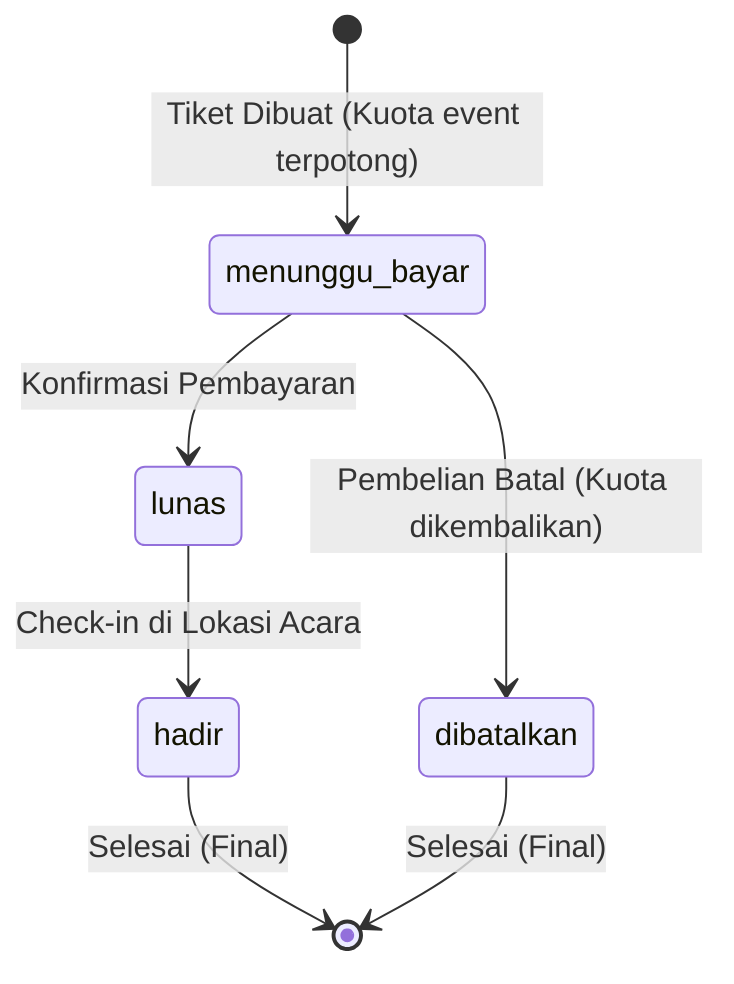

# 🎟️ Karsa Tiket - Aplikasi Tiketing Event Komunitas

> **Tugas Mandiri Sesi 3 · Bootcamp Web Programming with AI by Plan Indonesia**  
> Aplikasi manajemen event, kontak pembeli, pencatatan transaksi tiket, alur pembayaran & check-in, serta rekapitulasi penjualan berbasis **React**, **Cloud Firestore**, dan **Netlify**.

---

## 📌 1. Latar Belakang & Masalah yang Diselesaikan

Karsa Tiket adalah layanan tiket milik komunitas kreatif yang dikelola Laras untuk workshop seni dan konser kecil. Sebelumnya, pencatatan dilakukan manual lewat pesan pribadi dan spreadsheet, sehingga timbul masalah:
1. **Penjualan melebihi kuota ruangan** ➔ Aplikasi otomatis membatasi kuota kursi dan menandai status **Habis** saat kuota penuh.
2. **Status pembayaran tidak jelas** ➔ Alur status tiket terstruktur: `menunggu_bayar` ➔ `lunas` ➔ `hadir` (atau `dibatalkan`).
3. **Total dihitung manual & salah** ➔ Total dihitung otomatis dari harga tiket event × jumlah tiket.
4. **Pembelian nol tiket tercatat** ➔ Validasi ketat (jumlah tiket wajib 1 - 5 dan tidak melebihi sisa kuota).

---

## 🗂️ 2. Koleksi & Skema Data Firestore

Aplikasi mengelola 3 koleksi utama:

### A. Koleksi `event`
- **ID Dokumen**: Otomatis
- **Fields**:
  - `nama` (string, 1-60 karakter)
  - `tanggal` (string, format YYYY-MM-DD)
  - `lokasi` (string, 1-100 karakter)
  - `harga_tiket` (number bulat, min 0)
  - `kuota` (number bulat, 1-500)
  - `tiket_terjual` (number bulat, default 0, <= kuota)
  - `dibuat_pada` (timestamp)

### B. Koleksi `pembeli`
- **ID Dokumen**: `no_whatsapp`
- **Fields**:
  - `nama` (string, 1-60 karakter)
  - `no_whatsapp` (string, diawali 08, 10-13 angka)
  - `email` (string, mengandung `@`, maks 80 karakter)
  - `dibuat_pada` (timestamp)

### C. Koleksi `tiket`
- **ID Dokumen**: Otomatis
- **Fields**:
  - `event_id` (string ID event)
  - `nama_event` (string salinan nama event)
  - `tanggal_event` (string salinan tanggal YYYY-MM-DD)
  - `pembeli_id` (string ID pembeli / no_whatsapp)
  - `nama_pembeli` (string salinan nama pembeli)
  - `harga_tiket` (number salinan harga event)
  - `jumlah_tiket` (number 1-5, <= sisa kuota)
  - `total` (number: `harga_tiket` × `jumlah_tiket`)
  - `status` (`menunggu_bayar` | `lunas` | `hadir` | `dibatalkan`)
  - `dibuat_pada` (timestamp)

---

## 🔄 3. Alur Status Tiket & Penyesuaian Kuota



- **Data baru**: Selalu berstatus `menunggu_bayar` dan menambah `tiket_terjual` pada event.
- **Dibatalkan**: Mengurangi `tiket_terjual` pada event sehingga sisa kuota bertambah kembali.
- **Pendapatan di modul Rekap**: Dihitung **hanya** dari tiket yang berstatus `lunas` dan `hadir`. Tiket `menunggu_bayar` dan `dibatalkan` tidak dihitung.

---

## 🛡️ 4. Security Rules & Lembar Uji Mandiri

Berkas [`firestore.rules`](./firestore.rules) telah dipasang untuk melindungi data di Cloud Firestore. 

Tersedia fitur **Lembar Uji Mandiri** interaktif langsung di antarmuka web untuk menguji 6 skenario masukan tidak sah:
1. **Field kosong** (Nama event atau lokasi kosong ditolak).
2. **Tipe data salah / format email** (Email tanpa tanda `@` ditolak).
3. **Format nomor WhatsApp** (Nomor tanpa awalan 08 atau bukan 10-13 digit ditolak).
4. **Nilai negatif / di luar batas** (Harga negatif `< 0` atau kuota `0` ditolak).
5. **Jumlah tiket tidak sah** (Jumlah tiket `0` atau `> 5` atau melebihi kuota ditolak).
6. **Perubahan status melompat** (`menunggu_bayar` langsung lompat ke `hadir` ditolak).

---

## 🚀 5. Cara Menjalankan Aplikasi

### Persyaratan:
- Node.js versi 18 ke atas.
- NPM / PNPM.

### Langkah Instalasi:
```bash
# 1. Masuk ke direktori proyek
cd "d:/Karsa Tiket"

# 2. Install dependensi
npm install

# 3. Jalankan server lokal
npm run dev
```
Buka peramban di `http://localhost:5173`.

### Mengatur Koneksi Firebase (Opsional / Siap Pakai):
- Aplikasi dilengkapi tombol **"Mode Demo / Firestore Live"** di bilah atas.
- Anda dapat langsung menggunakan data contoh bawaan (Mode Demo offline), atau menempel konfigurasi Firebase proyek Anda untuk beralih ke live database Cloud Firestore secara instan!

---

## 🌐 6. Deploy ke Netlify

1. Hubungkan repositori GitHub ke akun Netlify.
2. Atur konfigurasi build:
   - **Build Command**: `npm run build`
   - **Publish Directory**: `dist`
3. Tambahkan environment variables di Netlify (opsional) atau gunakan fitur modal Firebase di web.
4. Klik **Deploy site**.
